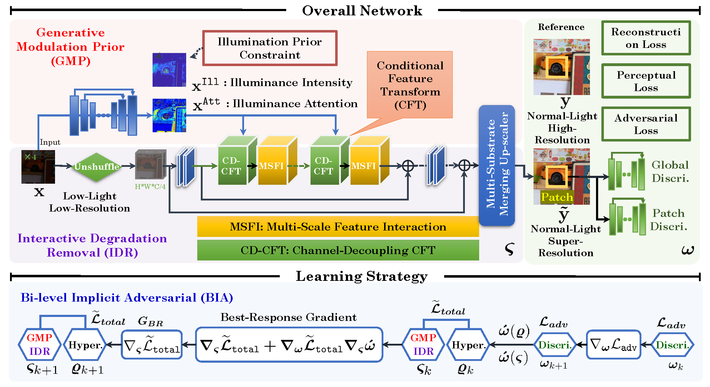

# [PR 2024] Collaborative brightening and amplification of low-light imagery via bi-level adversarial learning [[Paper]](https://www.sciencedirect.com/science/article/pii/S0031320324003091)
By Jiaxin Gao, Yaohua Liu, Ziyu Yue, Risheng Liu, and Xin Fan

Dalian University of Technology 

## Pipeline
<p align="center">
    
</p>


## Dependencies
```
# Install basicsr - https://github.com/xinntao/BasicSR
pip install basicsr
pip install facexlib gfpgan
pip install -r requirements.txt
python setup.py develop
````

## Download the raw training and evaluation datasets
### Paired dataset 
RELLISUR dataset: Andreas Aakerberg, Kamal Nasrollahi, Thomas Moeslund. "RELLISUR: A Real Low-Light Image Super-Resolution Dataset". NeurIPS Datasets and Benchmarks 2021. [RELLISUR](https://vap.aau.dk/rellisur/)

### Unpaired dataset 
Please refer to DARK FACE dataset: Yang, Wenhan and Yuan, Ye and Ren, Wenqi and Liu, Jiaying and Scheirer, Walter J. and Wang, Zhangyang and Zhang, and et al. "DARK FACE: Face Detection in Low Light Condition". IEEE Transactions on Image Processing, 2020. [DARK FACE](https://flyywh.github.io/CVPRW2019LowLight/)

## Pre-trained Models 
You can download our pre-trained model from [Baidu Yun (extracted code: oo89)](https://pan.baidu.com/s/1DIw94htO8kVD39XFx9SrVw) and place it in the directory `./experiments/pretrained_models/`.


## How to train?
The entire training process is divided into two stages. In the first stage, the generator is trained, and in the second stage, adversarial training is conducted. The weights of the trained generator from the first stage should be placed in `./experiments/pretrained_models/`.


```
cd CollaBA   
CUDA_VISIBLE_DEVICES=0 python collabagan/train.py -opt options/train_collabagan_x2plus_ue_our.yml --auto_resume   # For x2 task
CUDA_VISIBLE_DEVICES=0 python collabagan/train.py -opt options/train_collabagan_x4plus_ue_our.yml --auto_resume   # For x4 task
```


## Visual comparison 
<p align="center">
    
</p>
<p align="center">
    
</p>


## Citation
If you use this code or ideas from the paper for your research, please cite our paper:
```
@article{gao2024collaborative,
  title={Collaborative brightening and amplification of low-light imagery via bi-level adversarial learning},
  author={Gao, Jiaxin and Liu, Yaohua and Yue, Ziyu and Fan, Xin and Liu, Risheng},
  journal={Pattern Recognition},
  volume={154},
  pages={110558},
  year={2024},
  publisher={Elsevier}
}
```

## Acknowledgement
Part of the code is adapted from previous works: [BasicSR](https://github.com/xinntao/BasicSR), [MIRNet](https://github.com/swz30/MIRNet) and [Real-ESRGAN](https://github.com/xinntao/Real-ESRGAN) (code structure). We thank all the authors for their contributions.

Please contact me if you have any questions at: jiaxinn.gao@outlook.com

